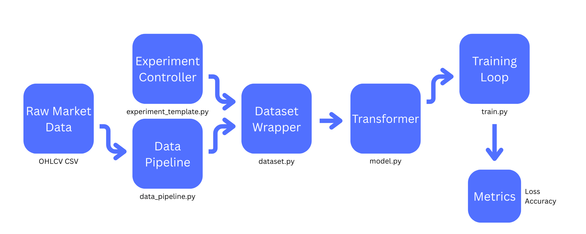

## Above Zero Transformer

# Overview
This is a transformer based model trained to predict whether returns after x hours will be positive or negative, given y hours of previous history
The model is given log returns, and the OHLCV

# Setup:
 - First run this in your terminal to ensure all dependencies are fulfilled and the virtual environment is created:
 - - python -m venv venv
 - - venv\Scripts\activate
 - - pip install -r requirements.txt
 - - python experiment_template.py
 - Go to experiment_template.py and run the file, all other scripts will run as needed
 - Ensure that AAPL.csv is in the same folder as all other scripts
 - To change the training windows:
 - - To change when the model predicts returns (H):
 - - - "window": H,
 - - To change how much training data the model interprets (H):
 - - - "seq_len": H,
 - Change the Epochs variable to alter how many times the model runs and backprops
 - - Recommended Epochs is ~50 (diminishing returns will occur after that)

# Output of the model:
 - The first print will be the binary positive rate of the target for the train and validation sets
 - - It's important to understand that the model is split between two sets, training and validation
 - - Training is what the model runs and backprops on
 - - After a full batch of windows is trained and backpropagated, the model goes into eval mode
 - - In eval mode the model runs its parameters on an unknown batch sets and does not alter parameters
 - - This happens once per epoch
 - Next, starting with Epoch 00, the model outputs the following statistics:
 - - Train Loss: this is the BCE loss with logits output of the model
 - - Train Acc: this is how accurate the model was with predicting positive or negative returns
 - - Val Loss: this is the same as train loss but without any backprop
 - - Val Acc: same as train acc but on unknown sets
 - - Val pred+ rate: this is what percentage of the time the model was predicting a positive return
 - As you will notice, the train Acc continues to climb while val Acc stays similar and lowers
 - This is a classic example of overfitting, and here are my hypotheses:
 - - The model doesn't have enough training data (2 years of ~3 day windows)
 - - specifically the validation set has a lack of data
 - - The inputs to the model are too simple and don't give the model enough data
 - - Actual signal engineering could massively help with this

# Architecture

# How does this model work?
 - This model uses a transformer encoder architecture designed for sequence modeling
 - - This doesn't necessarily guarantee better results, but it extends the potential of the model in data where relations are important
 - - The data pipeline works like this:
 - - - Raw OHLCV.csv  -Data Pipeline->  Refined Dataframe  -Data Pipeline->  Rolling Windows (X, y)  -Data Pipeline->  X, y Train and Validate Sets  -dataset->  X, y Train and Validate Tensors -> MODEL -> Transformer Encoder (learns patterns) -> Dropout -> Linear Classifier Head -> Single Logit -> Sigmoid + Probability -> Binary Prediction
 - - - - The rolling windows are set to have 24 hours of history and predict the next 48 by default
 - - - - - Each next window has a greater index of 1: (1-48) (2-49)
 - - - - Dropout is the zeroing of a percentage of neurons for each forward pass
 - - - - Dropout is done to find more robust signals and better reduce overfitting, although the model still massively overfits
 
# How do transformers work in relation to this project?
 - Transformer Classifier:
 - - Starting at the input, the transformer is fed a sequence. A sequence is a 2D chunk of data from a 3D input tensor
 - - That 2D slice (48, 6) (48 hours x 6 features) is then projected up to d_model (32 in this case) This makes the final input slice (48, 32)
 - - The transformer encoder then feeds that data through self attention and FFN, we already know this
 - - The classifier head is just a final nn.Linear(32,1) at the end of the pipeline. This is just the final output of the transformer

# Key Takeaways:
 - Dropout can help reduce overfitting when looking for complex patterns on limited data
 - How transformers process data
 - Overfitting is a primary challenge in this project
 - How to split projects into different scripts and call them
 - How to create rolling windows out of a df

# Notes:
 - This is a ML research project, NOT a profitable trading system
 - I do not reap the benefits or losses of a trading based on this model